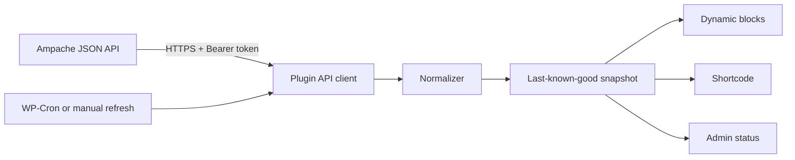

# WordPress Ampache Integration - Project Plan

> **Status: deployed and live (2026-08-08).** All 5 gates complete; the plugin is active on
> `https://jackson-brain.com/music/` (Library Statistics, Now Playing, Recently Played blocks).
> Post-launch fixes (WordPress's own SSRF guard blocking the configured LAN origin, several
> genuine Ampache-server-side API quirks affecting the stats view, and CSS/layout issues) are
> documented in `wordpress/README.md` and repo memory. See `06-validation-deployment.md` for the
> completed production-verification checklist.

Build a small, read-only WordPress plugin that presents selected information from the local
Ampache library on `https://jackson-brain.com`. The first release covers library totals, now
playing, and a short recent-listening view without exposing Ampache credentials or making public
page loads depend on Ampache being available.

This folder splits the project into reviewable components. Read this overview first, then use the
numbered documents as implementation work items.

## Plan components

1. [Product scope](01-product-scope.md) - audiences, MVP behavior, non-goals, and product decisions.
2. [Architecture and API](02-architecture-api.md) - data flow, Ampache endpoint map, caching, and failure behavior.
3. [Security and privacy](03-security-privacy.md) - credentials, least privilege, SSRF controls, WordPress security, and activity privacy.
4. [WordPress experience](04-wordpress-experience.md) - settings, blocks, shortcode compatibility, rendering, and accessibility.
5. [Implementation roadmap](05-implementation-roadmap.md) - plugin layout, class responsibilities, milestones, and gates.
6. [Validation and deployment](06-validation-deployment.md) - tests, live verification, release, rollback, and operations.

## Decisions already made

- Use Ampache's native JSON API at `/server/json.server.php` through WordPress's HTTP API.
- Authenticate server-side with a dedicated Ampache API key in an `Authorization: Bearer` header.
- Use that API key statelessly for normal calls. Do not persist or expose the session token returned
    by `handshake`; the handshake is a Gate A compatibility probe only.
- Use a dedicated Ampache level-25 User account, not an administrator or Music Assistant account.
- Keep the MVP read-only. It will not stream, alter ratings, manage playlists, or write play history.
- Fetch in background refresh jobs and render a normalized, cached snapshot.
- Keep the last successful snapshot when Ampache is unavailable.
- Provide dynamic WordPress blocks using `block.json` with `apiVersion: 3`, plus a compatibility shortcode.
- Default to hiding Ampache usernames and client names from public output.
- Use the canonical Ampache URL `https://music.jackson-brain.com`; retired `musicbox` references are historical.
- Never read Ampache's MariaDB schema directly, even though both applications use the same database server.

## Non-negotiable invariants

- Public and editor rendering performs zero outbound HTTP requests.
- The API client can construct only the methods listed in the approved read-method allowlist.
- Secrets never enter a URL, response body, snapshot, block attribute, post, REST response, metric,
  exception, or log context.
- A failed refresh never destroys a previously valid section.
- Every stored section carries its own success time and source/API provenance.
- At most one refresh owns the lock, and only that owner may release it.
- Redirects are disabled; the request origin and path are generated by the plugin.
- Changing the origin, credential, privacy policy, or snapshot schema invalidates incompatible state.
- Deactivation stops scheduling; uninstall data deletion remains an explicit administrator choice.
- A structural request-context guard blocks every Ampache call unless it runs inside WP-Cron or a
  fresh, capability-and-nonce-verified manual admin action; a shared cooldown throttles manual
  triggers independently of that check, so the music server never sees a public-traffic-driven burst.

## Target data flow

Public requests only read `D`. They do not wait for `A`.

## Delivery sequence

| Gate | Component | Exit condition | Status |
|---|---|---|---|
| A | API spike | A signed-off probe report and sanitized success, empty, and error fixtures capture deployed behavior. | ✅ Complete — see `gate-a-report.md` |
| B | Plugin core | Automated contract, security, concurrency, migration, and stale-data tests pass with no live dependency. | ✅ Complete — 84 unit tests passing |
| C | Presentation | Blocks and shortcode pass fixture snapshots, accessibility checks, and the zero-outbound-render assertion. | ✅ Complete |
| D | Staging | A completed checklist proves cron, page cache, privacy, outage/recovery, upgrade, and rollback behavior on WordPress 6.9.4. | ✅ Complete (re-verified against 6.9.6 post-core-upgrade) |
| E | Production | Versioned artifact checksum, backup reference, deployment record, smoke results, and rollback result are recorded. | ✅ Complete — live on `music` page since 2026-08-08 |

Each gate is a review stop. Do not proceed after a failed security, privacy, or stale-cache check.

## Plugin handbook alignment

The plugin follows the [WordPress Plugin Handbook](https://developer.wordpress.org/plugins/) and
its [best practices](https://developer.wordpress.org/plugins/plugin-basics/best-practices/) guide:
a single unique prefix family (`JBA_` constants, `jba_` options/hooks, the `JacksonBrain\Ampache`
namespace - never `wp_`, `__`, or a bare English word), an `includes/`-plus-main-file layout with
an `ABSPATH` guard in every file, `is_admin()`-gated conditional loading so public requests never
pull in settings/admin-page code, and the Settings API with strict sanitize callbacks rather than
hand-rolled option handling.

## Research basis

- [WordPress 6.9 Field Guide](https://make.wordpress.org/core/2025/11/25/wordpress-6-9-field-guide/)
- [WordPress Plugin Handbook](https://developer.wordpress.org/plugins/)
- [WordPress Plugin Best Practices](https://developer.wordpress.org/plugins/plugin-basics/best-practices/)
- [WordPress HTTP API](https://developer.wordpress.org/plugins/http-api/)
- [WordPress Security](https://developer.wordpress.org/apis/security/)
- [Block metadata](https://developer.wordpress.org/block-editor/getting-started/fundamentals/block-json/)
- [Ampache API](https://ampache.org/api/)
- [Ampache JSON methods](https://ampache.org/api/api-json-methods)
- [Ampache API errors](https://ampache.org/api/api-errors)
- [Ampache ACLs](https://ampache.org/docs/configuration/acl)
- [OpenSubsonic endpoints](https://opensubsonic.netlify.app/docs/endpoints/), reviewed but not selected for the MVP.

Repository topology is documented in [the root README](../../README.md),
[the WordPress README](../../wordpress/README.md), [the Ampache README](../../ampache/README.md),
and [the database README](../../database/README.md).